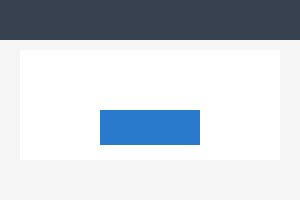
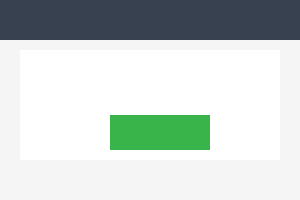
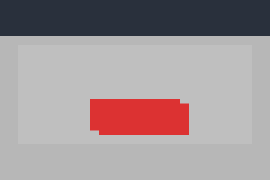

# go-regress

Visual regression testing library for Go. Compares UI screenshots using OpenCV to catch unintended visual changes.

## Setup

Requires Go and OpenCV 4.x. This project uses a Nix flake for reproducible dependencies.

```bash
# With direnv (auto-loads on cd into the project)
direnv allow

# Or enter the shell manually
nix develop
```

Then fetch Go modules:

```bash
go mod tidy
```

## Usage

### Quick comparison

```go
result, err := goregress.Compare("baseline.png", "current.png", nil)
if err != nil {
    log.Fatal(err)
}
if !result.Pass {
    log.Printf("regression detected: %.1f%% similarity (threshold: %.1f%%)",
        result.Similarity*100, result.Threshold*100)
}
```

### In tests with Suite

```go
func TestMain(m *testing.M) {
    goregress.BaselineDir = "testdata/baselines"
    goregress.DiffDir     = "testdata/diffs"
    os.Exit(m.Run())
}

func TestLoginScreen(t *testing.T) {
    suite := goregress.NewSuite(t.Name())
    screenshot := captureScreenshot() // your capture function
    suite.AssertMatch(t, "login_form", screenshot)
}
```

On first run, the baseline is saved automatically. Subsequent runs compare against it.

## Comparison methods

| Method | Best for | How it works |
|--------|----------|--------------|
| **SSIM** (default) | UI testing | Structural Similarity Index — perceives changes the way humans do |
| **Pixel** | Exact matching | Counts every pixel that differs, reports exact diff count |
| **Histogram** | Color shift detection | Compares overall color distribution, tolerant to small pixel changes |

```go
opts := &goregress.CompareOptions{
    Threshold: 0.99,
    Method:    goregress.MethodPixel,
}
result, err := goregress.Compare(baseline, current, opts)
```

## Examples

### Identical images — pass

Two screenshots of the same UI state:

| Baseline | Current |
|----------|---------|
|  |  |

```
Result {
    Pass:        true
    Similarity:  100.00%
    Threshold:   99.50%
    DiffPixels:  0
    TotalPixels: 60000
    Method:      SSIM
}
```

No diff image generated — the images are identical.

### Different images — regression detected

The button changed color (blue → green) and shifted position:

| Baseline | Current | Diff |
|----------|---------|------|
|  |  |  |

```
Result {
    Pass:        false
    Similarity:  92.83%
    Threshold:   99.50%
    DiffPixels:  4300
    TotalPixels: 60000
    Method:      Pixel
}
```

The diff image highlights changed regions in red. Unchanged areas are dimmed for context.

## Options

```go
opts := &goregress.CompareOptions{
    Threshold:      0.995,                       // minimum similarity to pass (0.0–1.0)
    Method:         goregress.MethodSSIM,         // SSIM, Pixel, or Histogram
    DiffOutputPath: "testdata/diffs/login.png",   // save diff image (empty = skip)
    Region:         image.Rect(0, 0, 800, 600),  // compare only this area
    IgnoreRegions: []image.Rectangle{             // mask out dynamic content
        image.Rect(10, 10, 200, 30),              // e.g., timestamp
    },
}
```

## Result

```go
type Result struct {
    Pass        bool          // did it meet the threshold?
    Similarity  float64       // 0.0–1.0
    Threshold   float64       // threshold used
    DiffPixels  int           // changed pixel count (Pixel method only)
    TotalPixels int           // total pixels compared
    DiffPath    string        // path to diff image, if generated
    Duration    time.Duration // how long the comparison took
    Method      CompareMethod // method used
}
```

## Running tests

```bash
go test -v ./...
```
